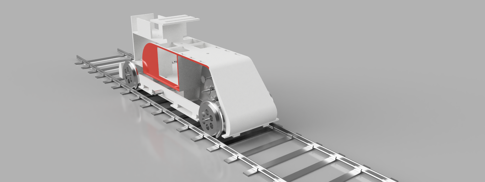

## 圣诞小火车奇遇之旅

这是一份技术文档汇总，主要介绍了圣诞小火车的硬件、机械结构、嵌入式代码等。

- 一些简单的介绍可以通过设计报告、视频和预提交ppt（https://1drv.ms/p/c/84c9984635f4f820/Ec5dhPh6r1hGjR61JKherjkBSfVEN543lnbwKaZI-xJIgA?e=UAQMFG）等方式了解。
- 电源、硬件、机械结构部分详细介绍请访问文档：
https://xn4zlkzg4p.feishu.cn/wiki/TbJOwzE71iRRNpkO2xwcQ5TinEe?from=from_copylink
- 嵌入式部分代码分为小车部分和中控板部分，具体代码在相应文件夹内。
- 机械结构的工程文档（Fusion360）可以在3D_Design文件夹内找到。

English:

This is a summary of the hardware, mechanical structure, and embedded code of the Christmas car.

- Some simple introductions can be obtained by watching design reports, videos, and pre-submitted ppts (https://1drv.ms/p/c/84c9984635f4f820/Ec5dhPh6r1hGjR61JKherjkBSfVEN543lnbwKaZI-xJIgA?e=UAQMFG).
- For more detailed information about power, hardware, and mechanical structure, please visit the documentation: https://xn4zlkzg4p.feishu.cn/wiki/TbJOwzE71iRRNpkO2xwcQ5TinEe?from=from_copylink
- The embedded code is divided into the car and the control board, and the specific code can be found in the corresponding folder.
- The mechanical structure's engineering documentation (Fusion360) can be found in the 3D_Design folder.

   